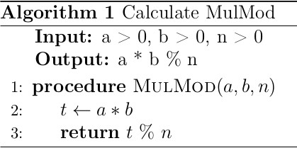
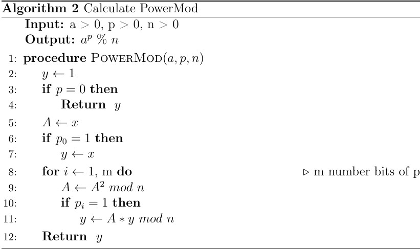
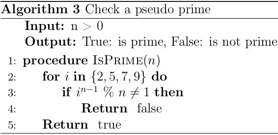
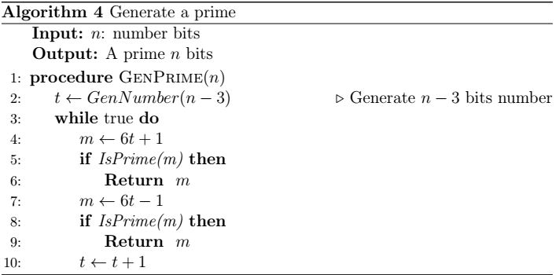
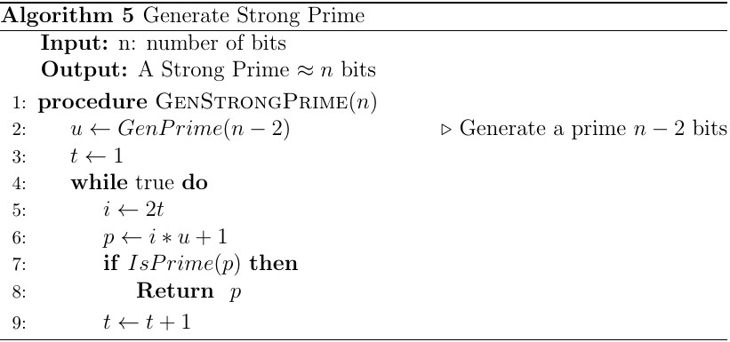
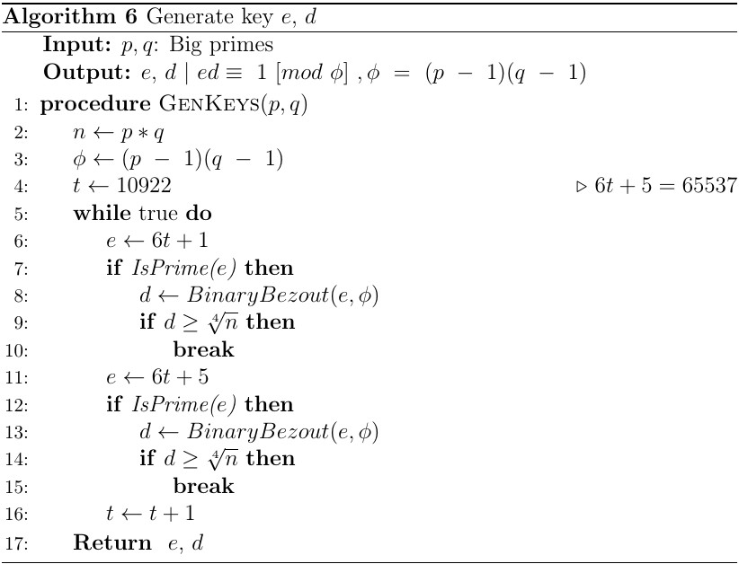

# RSA Implementation

This the RSA 2048 bits implementation using C++ with [Boost::multiprecision](https://www.boost.org/doc/libs/1_72_0/libs/multiprecision/doc/html/index.html).

## Table of content
- [Basic setup](#basic-setup)
    - [Big number data type](#big-number-data-type)
    - [MulMod calculation](#mulmod-calculation)
    - [PowMod calculation](#powmod-calculation)
    - [Primes test](#primes-test)

- [RSA calculations](#rsa-calculations)
	- [Generate strong primes](#generate-strong-primes)
	- [Find e and d](#find-e-and-d)
	- [Fast decryption using CRT](#fast-decryption-using-crt)
- [References](#references)

## Basic setup

The library used here is Boost. The next session will show how to represent a very big number by Boost::multiprecision. To install Boost library, follow this [tutorial for Windows](https://https://tomkoos.github.io/cpp/boost-vs.html) or [tutorial for Linux](https://onethinglab.com/2019/01/30/how-to-install-latest-boost-library-on-ubuntu/).

### Big number data type
Using this code to define a new data type for big number.
````C++
#include <boost/multiprecision/cpp_int.hpp>

namespace mp = boost::multiprecision;
typedef mp::number<mp::cpp_int_backend<4096, 4096, mp::signed_magnitude, mp::unchecked, void> >  number_t; // int4096_t
````
From now, we can use the data type **number_t** for 4096 bits numbers.

(***Note:*** *There is a space before close angle brackets* `>`).
### MulMod calculation
**MulMod** is giving 3 numbers *a, b, n* then caculate .

For RSA only 2048 bits with the **number_t** above, we can do **MulMod** by doing **multiply** first then doing **modulo**. Because for *a,b* 1024 bits then  is at most 2048 bits when **number_t** can be used for 4096 bits number. Below is **MulMod** algorithm.

<p align="center">
  
</p>


### PowMod calculation
**MulMod** is giving 3 numbers *a, b, n* then caculate .
Do **MulMod** using below algorithm(from \[[1](#ref1)\]).

<p align="center">
  
</p>

### Primes test
Using [Fermat little theorem](https://en.wikipedia.org/wiki/Fermat%27s_little_theorem) and [Pseudo prime](https://en.wikipedia.org/wiki/Pseudoprime), create algorithm to check a pseudo prime with some bases `{2,5,7,9}`. The algorithm is below

<p align="center">
  
</p>

*Note:* ***Carmichael numbers*** *are composite numbers that satisfies the Fermat’s little theorem. But we also can use Fermat’s little theorem to check primes because the probability that `n` is a Carmichael numbers is very small. The first 3 Carmichael numbers are* ***561***, ***1105*** *and* ***1729***.

## RSA calculations
The steps of RSA calculations are:


### Generate strong primes
#### Generate primes
- Two important properties:
	- ***All primes (past 2 and 3) are of the forms 6n+1 and 6n-1*** ([proof](https://primes.utm.edu/notes/faq/six.html)).
	- If `a` is `n` bits number, `b` is `m` bits number. Than `a*b` will have at most `n + m + 2` bits number. (\[[2](#ref2)\]).
- With the two properties above, the below algorithm wil generate a prime

<p align="center">
  
</p>

#### Generate strong primes
- The algorithm is followed the reference \[[3](#ref3)\].
- Generate a large random prime number `u`, then let `p` be the first prime in the sequence `i*u+1`, for *i=2,4,6,…*.

<p align="center">
  
</p>


### Find e and d

In step (3), (4). Do: 

- Pick `e` is a prime  65535.
- Find d satifies 

<p align="center">
  
</p>

- *BinaryBezout algorithm* to find `d` satifies .

### Fast decryption using CRT
- From \[[4](#ref4)\]:

<p align="center">
  
</p>

<p align="center">
  
</p>

<p align="center">
  
</p>


## References
[1] Bùi Doãn Khanh và Nguyễn Đình Thúc. Giáo trình mã hóa thông tin: Lý thuyết và ứng dụng, 2004. <a name="ref1"></a>

[2] Alfred J. Menezes, Scott A. Vanstone, and Paul C. Van Oorschot. Handbook of Applied Cryptography. CRC Press, Inc., USA, 1st edition, 1996. <a name="ref2"></a>

[3] R. L. Rivest, A. Shamir, and L. Adleman. A method for obtaining digital signatures and public-key cryptosystems. Communications of the ACM, 21, 2 1978. <a name="ref3"></a>

[4] J.-J. Quisquater and C. Couvreur. Fast decipherment algorithm for rsa public-key cryptosystem. Electronics Letters, 18, 1982. <a name="ref4"></a>